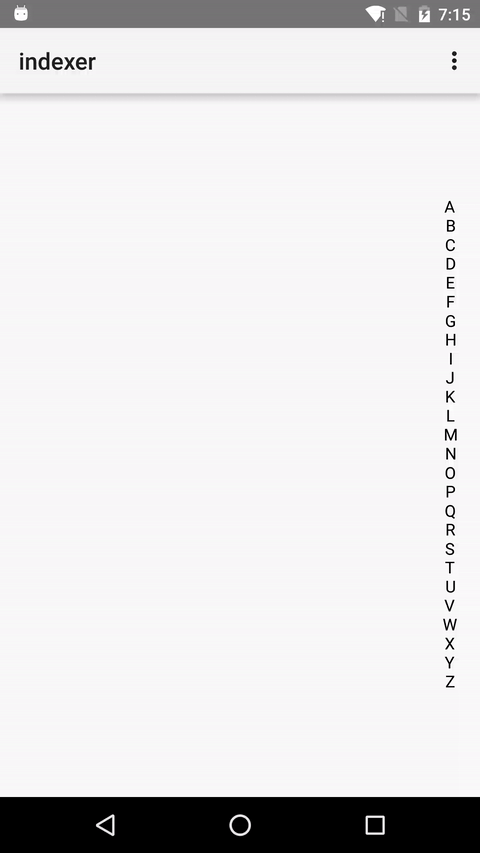

Android Indexer
===

An indexer view like Wechat' s.

### Screenshot


### Usage
```groovy
// import to your build.gradle
compile 'com.xiaolongtongxue:indexer:1.1'
```

```xml
<!-- Recommand adding bits of padding since the text width may too small making touch hard -->
<com.xiaolongtongxue.indexer.IndexerView
      android:id="@+id/indexer"
      android:layout_alignParentRight="true"
      android:layout_centerInParent="true"
      android:paddingLeft="4dp"
      android:paddingRight="4dp"
      android:layout_width="wrap_content"
      android:layout_height="wrap_content" />
```

```java
// ...
IndexerView indexerView = (IndexerView) findViewById(R.id.indexer);
// put list or String[]
List<String> list = new ArrayList<>();
  for (char i = 'A'; i <= 'Z'; i++) {
  list.add(Character.toString(i));
}
indexerView.setAlphabets(list);
// or just String
indexerView.setAlphabets("ABCDEFG");

// call the listener
indexerView.setOnIndexChangeListener(new IndexerView.OnIndexerChangeListener() {
  @Override public void onIndexChange(int index, String key) {
    // do sth with index or key
  }
});

// you can also change the text size and color
indexerView.setTextColor(Color.BLACK);
indexerView.setTextSize(TypedValue.applyDimension(TypedValue.COMPLEX_UNIT_SP, 14, getResources().getDisplayMetrics()));
// ...
```

### License
MIT
